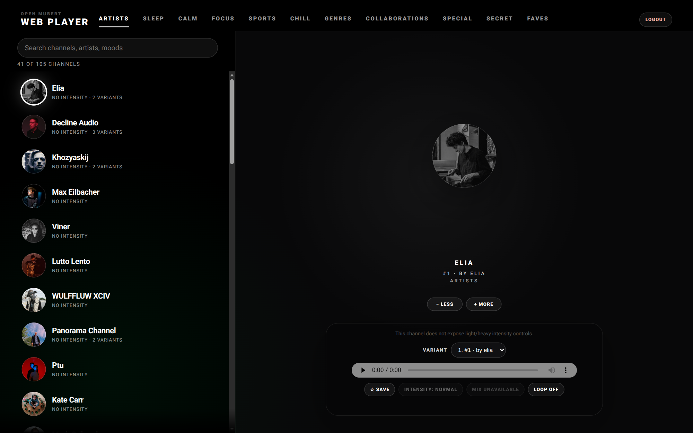

# Open Mubert Web

A desktop web player for Mubert channels, inspired by the Android tablet app UI. It signs in with existing Mubert app email/password credentials, shows the channel catalogue, and plays channels in the browser through a same-origin nginx relay.



## How to use with Docker

Published image example:

```bash
docker run --rm -p 8080:8080 ghcr.io/theblazehen/open-mubert-web:latest
```

The CI publishes to `ghcr.io/<owner>/<repo>:latest`; this repository's image is `ghcr.io/theblazehen/open-mubert-web:latest`.

Or build locally:

```bash
docker build -t open-mubert-web .
docker run --rm -p 8080:8080 open-mubert-web
```

Open:

```text
http://127.0.0.1:8080
```

Sign in with your Mubert app email/password, pick a channel, and press play. OAuth/social login is not implemented here.

## How it reaches Mubert

The frontend calls same-origin paths:

- `/mubert-api/` for `https://api-app.mubert.com/`
- `/mubert-stream/` for `https://stream.mubert.com/`

Those proxy locations are defined in `nginx/default.conf`. The browser talks only to your nginx host; nginx forwards API/audio requests to Mubert and rewrites Mubert cookies back onto your host. If you serve only the static files without those two proxy locations, login and playback will not work.

## How to run locally while editing

The app has no build step. It is static files plus nginx.

```bash
docker compose up relay
```

Edit files under `public/` or `nginx/default.conf`. The compose setup bind-mounts both, so frontend edits refresh immediately; restart the relay if you changed nginx config:

```bash
docker compose restart relay
```

For a clean stop:

```bash
docker compose down
```

## How to run on normal nginx

Copy the static files somewhere nginx can serve them:

```text
public/* -> /usr/share/nginx/html/
```

Then copy or adapt the relay config:

```text
nginx/default.conf -> /etc/nginx/conf.d/default.conf
```

Keep these parts from `nginx/default.conf`:

- `root /usr/share/nginx/html;`
- `location / { try_files $uri $uri/ /index.html; }`
- `location /mubert-api/ { proxy_pass https://api-app.mubert.com/; ... }`
- `location /mubert-stream/ { proxy_pass https://stream.mubert.com/; ... }`

If your nginx listens on a different port or runs behind TLS, adjust only the `listen`/server wrapper. The `/mubert-api/` and `/mubert-stream/` paths must remain same-origin with the static app.
